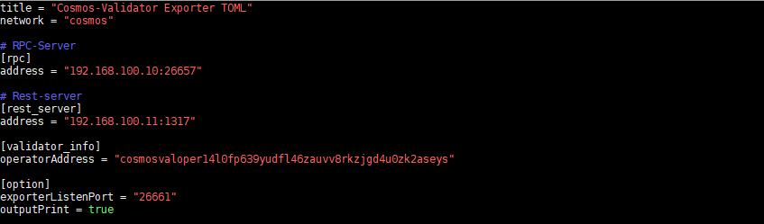

# cosmos-validator_exporter :satellite:


Cosmos 검증인을 위한 Prometheus exporter


## Introduction
Tendermint의 기본 Prometheus exporter(localhost:26660)에서 제공되지 않는 부분, 특별히 검증인의 정보를 모니터링하기 위한 exporter


## Collecting information list
> **Network**
- chainId: Chain 이름
- blockHeight: 블록 높이
- currentBlockTime: 블록 타임(현재 블록생성 시간-이전 블록생성 시간)
- bondedTokens(Atom): 본딩된 토큰 현황
- notBondedTokens(Atom): 본딩되지 않은 토큰 현황
- totalBondedTokens(Atom): 본딩된 토큰+본딩되지 않은 토큰
- bondedRate: 본딩률

- blockPerYear: 1년에 생성되는 block의 수
- defaultBlockTime: 기본 블록 타임
- defaultBlockTimeInflation: 기본 블록 타임에 대한 인플레이션
- currentBlockTimeInflation: 현재 블록 타임에 대한 인플레이션
- inflationMax: 최대 인플레이션
- inflationMin: 최소 인플레이션
- inflationRateChange: 인플레이션 변경율
- inflationGoalBonded: 인플레이션의 목표 본딩률

- validatorCount: 검증인 수
- precommitRate: Precommit 참여율
- proposerWalletAccountNumber: 검증인의 지갑에 대한 Account number(Grafana에서 Proposer 표현 시 활용되며 정리된 파일이 $HOME 디렉토리에 "validatorsWalletAccounNumber.csv"로 저장됨)

> **Validator Info**
- moniker: 검증인의 moniker
- accountAddress: 검증인의 Account address
- consHexAddress: 검증인의 Consensus Hex address
- operatorAddress: 검증인의 Operator address
- validatorPubKey: 검증인의 Validator pubkey(```gaiad tendermint show-validator```)
- votingPower: 검증인의 보팅 파워 (소수점 생략)
- delegatorShares: 검증인의 위임량
- delegatorCount: 검증인의 위임자 수
- delegationRatio: Network 본딩에 대한 검증인의 위임량 비율
- selfDelegationAmount: 검증인의 자체 위임량
- proposerPriorityValue: 검증인의 Proposer 우선순위 값
- proposerPriority: 검증인의 Proposer 우선순위
- proposingStatus: 검증인의 Proposer 여부(true: 1, false: 0)
- validatorCommitStatus: 검증인의 Commit 여부(true: 1, false: 0)
- commissionMaxChangeRate: 검증인의 수수료 최대 변경률
- commissionMaxRate: 검증인의 최대 수수료율
- commissionRate: 검증인의 현재 수수료율
- balances(uatom): 검증인의 지갑 정보
- commission(uatom): 검증인의 누적된 수수료 정보
- rewards(uatom): 검증인의 누적된 리워드 정보
- minSelfDelegation(Atom): 검증인의 최소 위임량 기준
- jailed: 검증인의 감옥 상태(true: 1, false: 0)

.png)


## Quick Start
프로그램 실행을 위해서는 RPC 및 REST 서버의 정보가 필요
- 다운로드
```
wget https://github.com/node-a-team/cosmos-validator_exporter/releases/download/v0.1.0/cosmos-validator_exporter_v0.1.0.tar.gz
tar -xzvf cosmos-validator_exporter_v0.1.0.tar.gz &&  cd cosmos-validator_exporter
```

 - Config 설정
 1) RPC 및 Rest 서버 정보 입력
 2) 검증인 Operator Address 입력(```gaiacli keys show [Key Name] --bech=val --address```)
 3) exporter 포트 설정
 4) outPrint 설정(true로 설정할 경우 exporter에서 수집되는 정보 출력)
```
vi config.toml
```
```
# TOML Document for Cosmos-Validator Exporter(Pometheus & Grafana)

title = "Cosmos-Validator Exporter TOML"
network = "cosmos"

# RPC-Server
[rpc]
address = "localhost:26657"

[rest_server]
address = "localhost:1317"

[validator_info]
operatorAddress = "cosmosvaloper14l0fp639yudfl46zauvv8rkzjgd4u0zk2aseys"

[option]
exporterListenPort = "26661"
outputPrint = true
```



 - 실행
```
./cosmos-validator_exporter
```

.png)


## Grafana 예시
Grafana의 알람 기능을 활용하면 각 지표에 대한 알람 설정도 가능(예를 들면 검증인이 Precommit에 참여하지 못했을 때, 혹은 Jail 당했을 때 등)
.png)

